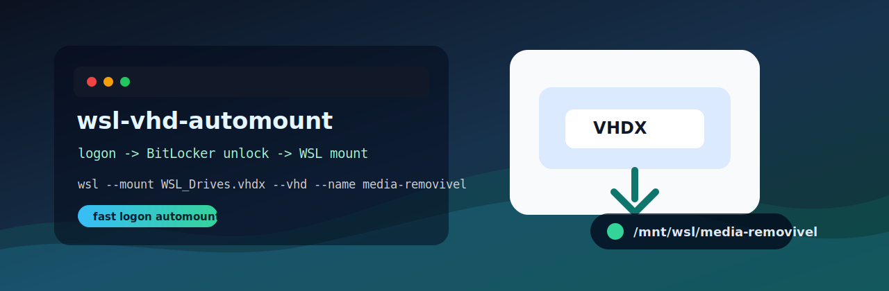
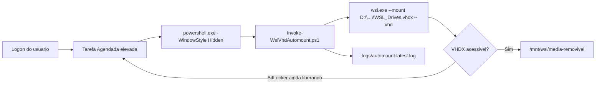

# wsl-vhd-automount

<p align="center">
  
</p>

<p align="center">
  <a href="https://github.com/LuizFernandoDeveloper/wsl-vhd-automount/blob/main/LICENSE"></a>
  
  
  
  
</p>

Automount silencioso e rapido para VHDX ext4 no WSL 2. Ele monta um disco Linux extra no logon do Windows sem depender de `\\.\PHYSICALDRIVE2` fixo, sem abrir janela, chamando `wsl.exe --mount ... --vhd` por um runner escondido que grava logs locais.

> Objetivo: terminou o logon, o Windows liberou o drive, o WSL ja tenta montar o VHDX em `/mnt/wsl/media-removivel`.

## Sumario

- [Por Que Existe](#por-que-existe)
- [Inicio Rapido](#inicio-rapido)
- [BitLocker E Velocidade](#bitlocker-e-velocidade)
- [Comandos](#comandos)
- [Configuracao](#configuracao)
- [Diagnostico Do Host](#diagnostico-do-host)
- [Arquitetura](#arquitetura)
- [Troubleshooting](#troubleshooting)
- [Estrutura](#estrutura)
- [Disciplina De Commits](#disciplina-de-commits)
- [Licenca](#licenca)
- [Referencias](#referencias)

## Por Que Existe

O `.bat` original fazia algo assim:

```bat
Mount-VHD -Path D:\disk-removivel-wsl2\WSL_Drives.vhdx
wsl --mount \\.\PHYSICALDRIVE2
```

Isso quebra facil porque o numero `PHYSICALDRIVE2` nao e contrato estavel. Ele pode mudar depois de reboot, troca de discos, USB/removivel, `wsl --shutdown`, ou qualquer mudanca na enumeracao de storage do Windows.

Este projeto resolve de duas formas:

| Modo | Quando usar | Como funciona |
| --- | --- | --- |
| Logged, padrao | Melhor equilibrio | PowerShell escondido chama `wsl.exe --mount <VHDX> --vhd` e grava log local |
| Direct | Mais rapido, sem log | Tarefa Agendada chama `C:\Windows\System32\wsl.exe` direto com `--mount <VHDX> --vhd` |
| Bootstrap | Mais resiliente | PowerShell procura a pasta, registra log, faz retry proprio e chama o script de montagem |
| Compativel | WSL antigo ou fallback | `Mount-VHD`, descobre o `PhysicalDrive` dinamicamente com `Get-Disk`, e so entao chama `wsl --mount` |

O modo rapido fica ativo por padrao porque seu WSL atual ja mostra suporte a `wsl --mount --vhd`.

## Inicio Rapido

1. Clone ou baixe este projeto no mesmo conjunto de pastas do seu `WSL_Drives.vhdx`.
2. Confirme o caminho em `config/wsl-vhd.config.ps1`.
3. Instale a automacao de logon.

Com dois cliques:

```bat
launchers\instalar_automount_logon.bat
```

Ou pelo PowerShell como Administrador:

```powershell
.\scripts\Install-StartupTask.ps1 -RunNow
```

Depois do mount, o disco fica disponivel no WSL em:

```text
/mnt/wsl/media-removivel
```

No Explorer, use o caminho da sua distro:

```text
\\wsl.localhost\<NomeDaDistro>\mnt\wsl\media-removivel
```

Dentro da distro, se quiser um link fixo no home:

```sh
ln -sfn /mnt/wsl/media-removivel ~/media-removivel
```

## BitLocker E Velocidade

Para volume com BitLocker, a melhor janela e o **logon**, nao o boot puro. Antes do logon, o volume de dados pode ainda estar bloqueado. No logon, o Windows tem contexto para liberar o disco e a Tarefa Agendada dispara imediatamente.

Configuracao atual focada em velocidade:

```powershell
StartupTaskMode = 'Logged'
StartupInitialDelaySeconds = 0
StartupRetryMinutes = 10
StartupRetryIntervalSeconds = 3
TaskPriority = 4
PreferDirectVhdMount = $true
```

O que isso significa:

| Ajuste | Valor | Motivo |
| --- | ---: | --- |
| Inicio imediato | `0s` | a task dispara assim que o usuario faz logon |
| Modo da task | `Logged` | roda escondido e captura log sem abrir tela |
| Restart curto | `3s` | se BitLocker/drive ainda estiver terminando de liberar, o Agendador tenta de novo rapido |
| Janela de restart | `10min` | cobre logons lentos, USB/removivel e desbloqueio manual |
| Prioridade da task | `4` | evita o padrao `7`, que o Windows usa para tarefas em background |
| Mount direto | ligado | usa `wsl --mount --vhd` e evita `PhysicalDrive` |

No Agendador de Tarefas, a acao padrao fica assim:

| Campo | Valor |
| --- | --- |
| Programa/script | `powershell.exe` |
| Argumentos | `-NoProfile -ExecutionPolicy Bypass -WindowStyle Hidden -File ...\scripts\Invoke-WslVhdAutomount.ps1` |
| Iniciar em | vazio |

Se voce trocar para `StartupTaskMode = 'Direct'`, a acao fica como na tela manual:

| Campo | Valor |
| --- | --- |
| Programa/script | `C:\Windows\System32\wsl.exe` |
| Argumentos | `--mount D:\disk-removivel-wsl2\WSL_Drives.vhdx --vhd --type ext4 --name media-removivel` |
| Iniciar em | vazio |

### Auto-unlock Do BitLocker

Para montar ainda mais cedo, o drive que contem o VHDX precisa estar desbloqueado automaticamente no logon. O projeto inclui um script para habilitar auto-unlock no drive onde o VHDX mora:

```bat
launchers\habilitar_bitlocker_autounlock.bat
```

Ou:

```powershell
.\scripts\Enable-VhdDriveAutoUnlock.ps1
```

Use isso somente no computador em que voce confia. Auto-unlock melhora a ergonomia e a velocidade, mas tambem muda o modelo de seguranca: aquele Windows passa a ter material local para liberar o volume depois que a sessao/OS estiver desbloqueada.

## Comandos

| Objetivo | Comando |
| --- | --- |
| Instalar automount no logon | `.\launchers\instalar_automount_logon.bat` |
| Remover automount | `.\launchers\remover_automount_logon.bat` |
| Montar agora | `.\launchers\media_removivel_init.bat` |
| Montar via PowerShell | `.\scripts\Mount-WslVhd.ps1` |
| Ver status | `.\scripts\Show-Status.ps1` |
| Diagnosticar host | `.\launchers\diagnosticar_host_wsl.bat` |
| Habilitar BitLocker auto-unlock do drive do VHDX | `.\launchers\habilitar_bitlocker_autounlock.bat` |
| Desmontar | `.\scripts\Unmount-WslVhd.ps1` |
| Desmontar apos encerrar WSL | `.\scripts\Unmount-WslVhd.ps1 -ShutdownWsl` |

## Configuracao

Arquivo principal:

```text
config/wsl-vhd.config.ps1
```

Exemplo:

```powershell
$WslVhdConfig = @{
    VhdPath = '..\WSL_Drives.vhdx'
    MountName = 'media-removivel'
    FileSystem = 'ext4'
    Partition = $null
    MountOptions = ''

    DistroName = ''
    StartDistro = $false

    PreferDirectVhdMount = $true
    WarmWslService = $true

    StartupTaskMode = 'Logged'
    StartupInitialDelaySeconds = 0
    StartupRetryMinutes = 10
    StartupRetryIntervalSeconds = 3
    TaskPriority = 4
    TaskHidden = $true

    LatestLogName = 'automount.latest.log'
    ErrorLogDirectory = '.\logs\errors'
}
```

### Quando Trocar O Modo De Mount

Mantenha o modo `Logged` para rodar sem tela e com log:

```powershell
StartupTaskMode = 'Logged'
PreferDirectVhdMount = $true
```

Use `Direct` apenas se quiser o caminho cru mais curto e aceitar ficar sem log do comando:

```powershell
StartupTaskMode = 'Direct'
```

Use bootstrap quando quiser log proprio, procura por drive em letras diferentes, ou retry dentro do PowerShell:

```powershell
StartupTaskMode = 'Bootstrap'
```

Troque `PreferDirectVhdMount` para `false` se o seu WSL nao aceitar `--vhd` ou se voce quiser reproduzir o fluxo classico `Mount-VHD` + `Get-Disk` + `wsl --mount`.

## Diagnostico Do Host

Rode:

```bat
launchers\diagnosticar_host_wsl.bat
```

O diagnostico coleta:

- volumes e discos do Windows;
- status BitLocker quando executado como Administrador;
- estado do VHDX;
- versao e distros WSL;
- Tarefa Agendada, prioridade, retries e estado atual.

No meu shell nao elevado, a leitura detalhada de BitLocker retornou `Acesso negado`, o que e esperado. Para confirmar os principais HDs com BitLocker, rode o diagnostico elevado ou use:

```powershell
Get-BitLockerVolume
```

## Arquitetura



No modo `Bootstrap`, o wrapper fica em:

```text
%LOCALAPPDATA%\WslVhdAutomount\Start-WslVhdAutomount.ps1
```

Ele procura o projeto em todos os drives. Isso ajuda quando a letra da midia muda.

## Troubleshooting

### Logs Silenciosos

O modo `Logged` grava em:

```text
logs\automount.latest.log
logs\errors\
```

Politica de sobrescrita:

- se `automount.latest.log` era sucesso, ele pode ser sobrescrito pela proxima execucao;
- se `automount.latest.log` tinha erro, ele e movido para `logs\errors\automount.TIMESTAMP.previous-error.log` antes de uma nova tentativa;
- se a execucao atual falhar, ela tambem ganha uma copia em `logs\errors\automount.TIMESTAMP.error.log`.

Assim erro antigo nao some em silencio.

### A montagem nao apareceu no WSL

No modo `Logged`, veja primeiro:

```text
logs\automount.latest.log
logs\errors\
```

Depois confira o resultado da Tarefa Agendada:

```powershell
Get-ScheduledTaskInfo -TaskName "WSL VHD Automount"
```

Depois rode:

```powershell
.\scripts\Show-Status.ps1
```

No modo `Bootstrap`, veja tambem os logs:

```text
.\logs\wsl-vhd-automount.log
%LOCALAPPDATA%\WslVhdAutomount\bootstrap.log
```

### O VHDX esta em um drive BitLocker

Confirme se o drive esta desbloqueado:

```powershell
Get-BitLockerVolume
```

Se quiser habilitar auto-unlock para o drive do VHDX:

```powershell
.\scripts\Enable-VhdDriveAutoUnlock.ps1
```

### O WSL antigo nao aceita `--vhd`

Altere a config:

```powershell
PreferDirectVhdMount = $false
```

Depois reinstale a task:

```powershell
.\scripts\Install-StartupTask.ps1 -RunNow
```

### O WSL travou segurando o disco

```powershell
.\scripts\Unmount-WslVhd.ps1 -ShutdownWsl
.\scripts\Mount-WslVhd.ps1
```

## Estrutura

```text
wsl-vhd-automount
|-- assets
|   `-- banner.svg
|-- config
|   `-- wsl-vhd.config.ps1
|-- launchers
|   |-- diagnosticar_host_wsl.bat
|   |-- habilitar_bitlocker_autounlock.bat
|   |-- instalar_automount_logon.bat
|   |-- media_removivel_init.bat
|   `-- remover_automount_logon.bat
|-- scripts
|   |-- Enable-VhdDriveAutoUnlock.ps1
|   |-- Install-StartupTask.ps1
|   |-- Invoke-WslVhdAutomount.ps1
|   |-- Mount-WslVhd.ps1
|   |-- Remove-StartupTask.ps1
|   |-- Show-HostReadiness.ps1
|   |-- Show-Status.ps1
|   |-- Unmount-WslVhd.ps1
|   `-- WslVhd.Common.ps1
|-- LICENSE
`-- README.md
```

## Disciplina De Commits

Mesma linha do `Backup_wsl-`: commits pequenos, uma coisa por commit, stage explicito por arquivo e diff revisado antes de gravar.

Fluxo recomendado:

```powershell
git status
git diff
git add README.md
git diff --staged
git commit -m "docs: improve readme"
```

Quando uma alteracao misturar assuntos diferentes, separe com `git add -p`, `git add -i` ou commits independentes.

## Licenca

Distribuido sob a licenca Apache License 2.0. Veja [LICENSE](LICENSE).

Copyright 2026 Luiz Fernando.

## Referencias

- [GitHub Docs: About READMEs](https://docs.github.com/en/repositories/managing-your-repositorys-settings-and-features/customizing-your-repository/about-readmes)
- [GitHub Docs: Licensing a repository](https://docs.github.com/en/repositories/managing-your-repositorys-settings-and-features/customizing-your-repository/licensing-a-repository)
- [Microsoft Learn: Mount a Linux disk in WSL 2](https://learn.microsoft.com/en-us/windows/wsl/wsl2-mount-disk)
- [Microsoft Learn: Basic commands for WSL](https://learn.microsoft.com/en-us/windows/wsl/basic-commands)
- [Microsoft Learn: TaskSettings.Priority](https://learn.microsoft.com/en-us/windows/win32/taskschd/tasksettings-priority)
- [Microsoft Learn: New-ScheduledTaskSettingsSet](https://learn.microsoft.com/en-us/powershell/module/scheduledtasks/new-scheduledtasksettingsset)
- [Microsoft Learn: Enable-BitLockerAutoUnlock](https://learn.microsoft.com/en-us/powershell/module/bitlocker/enable-bitlockerautounlock)
- [Apache License 2.0](https://www.apache.org/licenses/LICENSE-2.0)
